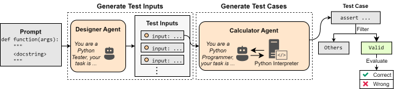

# TestChain

The image below shows the architecture of Testchain.



The image below shows an example of how a large model generates correct test cases by interacting with external tools.




## Dataset

All datasets used in the experiment can be found here.

[README](./data/README.md)

## Install

- Install Python pkgs

```bash
pip install -r requirements.txt
```


## Run

### Run Approaches

- Entry point

`main.py`

- Args

| args          | description |
| -             | - |
| --config      | Path of the config file                               |
| --mode        | Run mode, one of `TestGenerator`, `TestAgent`, `TestChain`   |
| --prompt_type | Prompt type, support `codet` for `TestGenerator`, `0-shot` and `1-shot` for `TestAgent`, `py_inter` for `TestChain`
| --api_key     | OpenAI or DeepInfra API key |
| --base_url    | `https://api.openai.com/v1` for OpenAI and `https://api.deepinfra.com/v1/openai` for DeepInfra |


For example, run `TestGenerator` method with `codet` prompt type: 

```bash
python main.py \
--config='config/humaneval/config-codellama-34b.json' \
--mode=TestGenerator \
--prompt_type=codet \
--api_key=<deepinfra api key> \
--base_url='https://api.deepinfra.com/v1/openai'
```

And the directory for the run results will be `result/humaneval/codellama-34b/TestGenerator_codet`.


### Count Result

- Entry point

`count.py`

- Args

|args|description|
| - | - |
| --base_dir | Result directory |
| --max_nums | Maximum number of assert statements retained for each problem, set to $10$ in our experiments |

- For example, count result of `TestGenerator` method with `codet` prompt type: 

```bash
python count.py \
--base_dir=result/humaneval/codellama-34b/TestGenerator_codet \
--max_nums=10
```


### Count Coverage

- Entry point

`count_coverage.py`

- Args

|args|description|
| - | - |
| --dataset_path    | Path of the dataset file      |
| --base_dir        | Result directory              |
| --max_nums        | Maximum number of assert statements retained for each problem, set to $10$ in our experiments |
| --time_limit      | Maximum seconds for a single question. Due to coverage being implemented using Python `sys.settrace`, a more lenient time limit is needed. Set to $10$ in our experiments. |

- For example, count coverage of `TestGenerator` method with `codet` prompt type: 

```bash
python count_coverage.py \
--dataset_path=data/humaneval-wo-examples.jsonl \
--base_dir=result/humaneval/codellama-34b/TestGenerator_codet \
--max_nums=10 \
--time_limit=10
```


