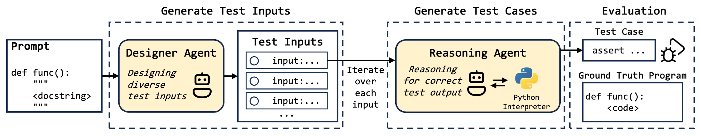
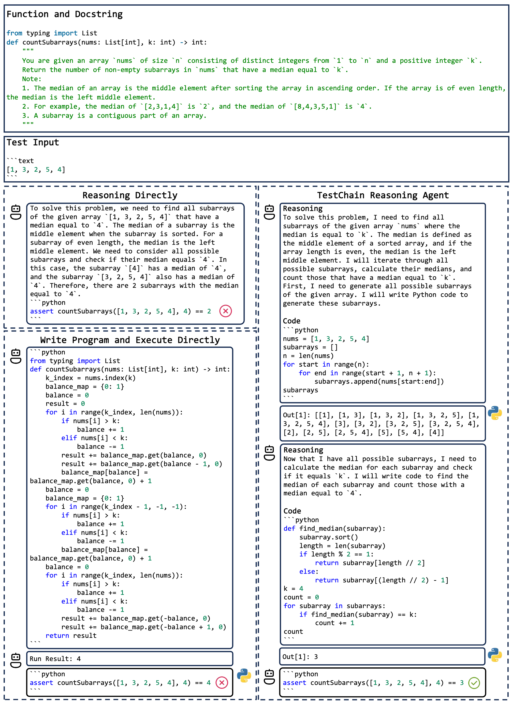

# TestChain

LLM-powered multi-agent framework with code-assisted
reasoning for text-to-testcase generation

- The image below shows the architecture of Testchain.



- The image below shows an example of the code-assisted reasoning.




## Dataset

All datasets used in the experiment can be found here.

[README](./data/README.md)

## Install

- Install Python pkgs

```bash
pip install -r requirements.txt
```


## Run

### Run Approaches

- Entry point

`main.py`

- Args

| args          | description |
| -             | - |
| --config      | Path of the config file                           |
| --mode        | Run mode, one of `TestAgent`, `TestChain`   |
| --prompt_type | Prompt type, support `0-shot` (CodeT-TG) and `1-shot` (Reflexion-TG), `py_inter` (TestChain)
| --api_key     | OpenAI or DeepInfra API key |
| --base_url    | `https://api.openai.com/v1` for OpenAI and `https://api.deepinfra.com/v1/openai` for DeepInfra |


For example:

```bash
python main.py \
--config 'config/leetcode-hard/config-gpt4o.json' \
--mode 'TestChain' \
--prompt_type 'py_inter' \
--api_key 'sk-y0MnhSWH7QZTgOB2uwjMTd3FnS1jSxeqlKEz2TdWeo8c6QGJ' \
--base_url 'https://api.chatanywhere.tech/v1'

--api_key 'xxx' \
--base_url 'xxx'
```

And the directory for the run results will be `result/leetcode-hard/gpt4o/TestChain_py_inter`.


### Count Result

- Entry point

`count.py`

- Args

|args|description|
| - | - |
| --base_dir | Result directory |
| --max_nums | Maximum number of assert statements retained for each problem, set to $10$ in our experiments |

- For example:

```bash
python count.py \
--base_dir 'result/leetcode-hard/gpt4o/TestChain_py_inter' \
--start 0 \
--end 39 \
--max_nums 10
```


### Count Coverage

- Entry point

`count_coverage.py`

- Args

|args|description|
| - | - |
| --dataset_path    | Path of the dataset file      |
| --base_dir        | Result directory              |
| --max_nums        | Maximum number of assert statements retained for each problem, set to $10$ in our experiments |
| --time_limit      | Maximum seconds for a single question. Due to coverage being implemented using Python `sys.settrace`, a more lenient time limit is needed. Set to $10$ in our experiments. |

- For example:

```bash
python count_coverage.py \
--dataset_path 'data/leetcode-hard-wo-examples.jsonl' \
--base_dir 'result/leetcode-hard/TestChain_py_inter' \
--start 0 \
--end 39 \
--max_nums 10 \
--time_limit 10
```
